# JDK 설치

## 1. Open JDK 사이트 선택
[1. 어답티움 (https://adoptium.net/✅)](https://adoptium.net/)  
[2. https://jdk.java.net/](https://jdk.java.net/)  
이클립스 재단에서 관리하는 1. 어답티움 사용하기, 2번 사용해도 됨  

<br>

## 2. 운영체제에 맞는 OS 선택
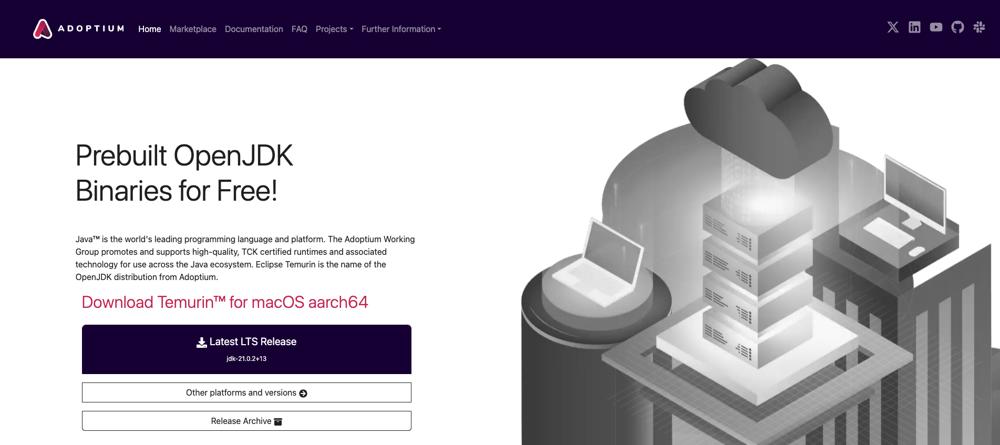
위 이미지에서 `Other platforms and versions` 선택

<br>

## 다운로드
원하는 버전 선택
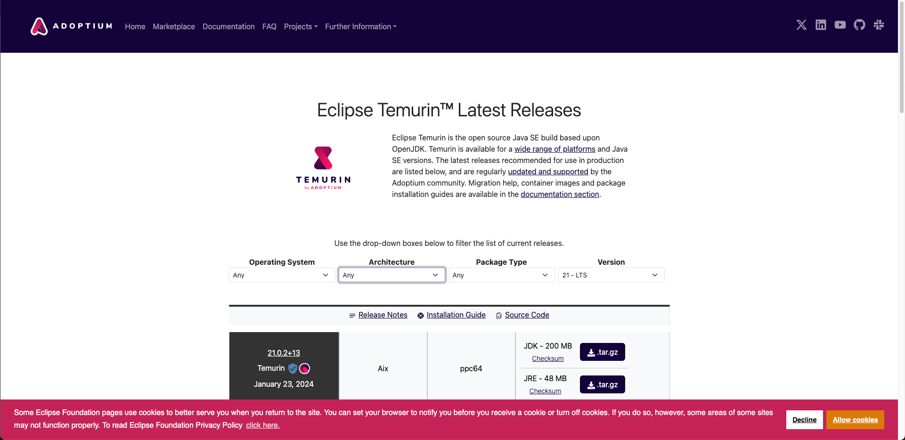
|운영체제|설치 파일명|
|-|-|
|Windows x64✅|OpenJDK17-jdk_x64_windows_hotspot_17.0.3_7.msi|
|macOS x64(Intel Chip)|OpenJDK17-jdk_x64_mac_hotspot_17.0.3_7.pkg|
|macOS aarch64(Apple M1 Chip)|OpenJDK17-jdk_aarch64_mac_hotspot_17.0.3_7.pkg|

<br>

## 설치
다운로드 받은 파일 실행  
`Next` 선택  
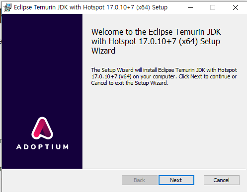

<br>

`Browse...` 선택  
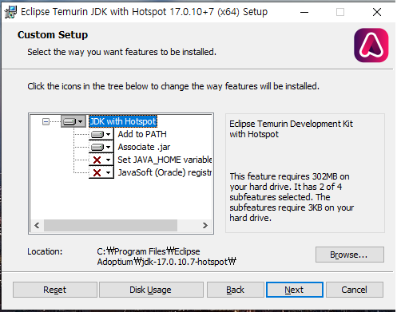

<br>

`Floder name`을 `C:₩Program Files₩Java₩jdk-17.0.10`으로 입력 후 `OK` 선택  
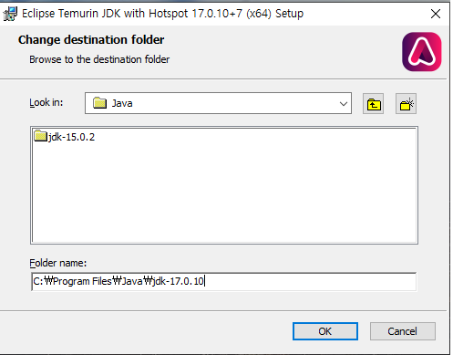

<br>

`Install` 선택  
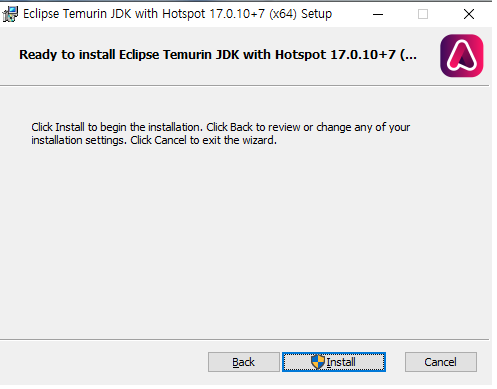

<br>

## WindowsOS 환경변수 설정
`내 PC` -> `속성` -> `고급 시스템 설정` -> `환경 변수` 선택  
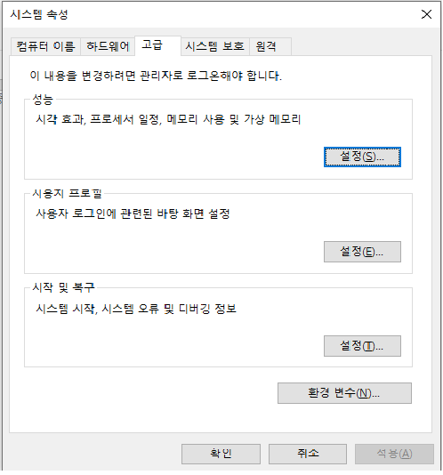

<br>

`새로 만들기` 선택  
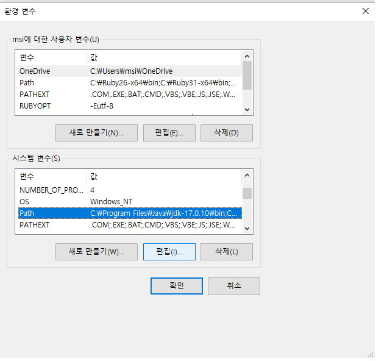

<br>

`JAVA_HOME` 입력 후 JDK 위치 붙여넣기  
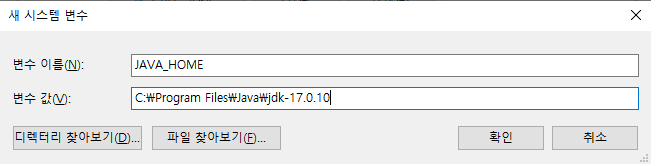

<br>

JDK 파일이 있는 위치 복사해서 붙여넣기(`디렉토리 찾아보기` or `C드라이브->Program Files->Java`에서 위치 복사)  
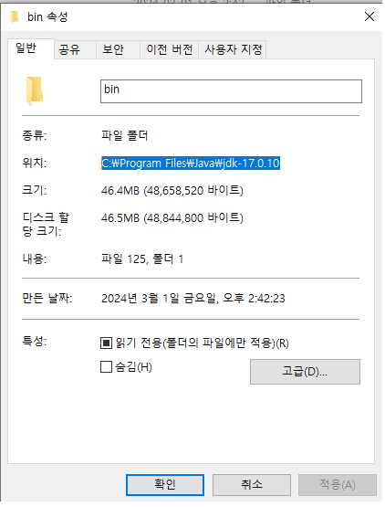


<br>

Path 환경변수에 경로 추가  
기존에 존재한다면 놔두고 없다면 추가  
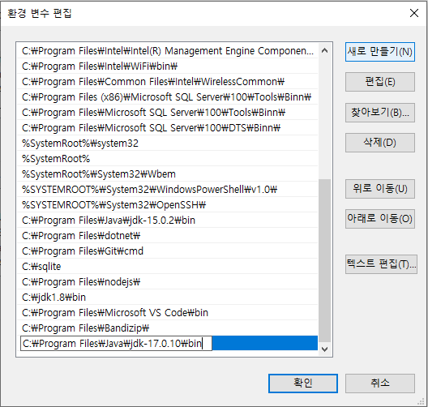

<br>

Path에서 우선순위를 제일 위로 올려주기  
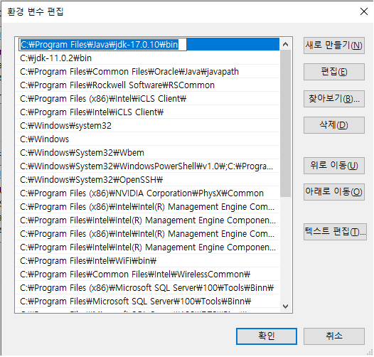

<br>

`%JAVA_HOME%\bin`입력: JAVA_HOME의 환경 변수 값을 의미  
(즉, JDK 바뀔 때 JAVA_HOME과 Path 둘 다 안바꾸고 JAVA_HOME만 바꿔주면 됨)  
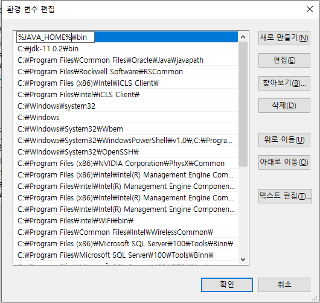

<br>

## 환경 변수 설정 확인
cmd 명령 프롬프트 창에서 명령어 입력
```
javac -version
```

```
java -version
```